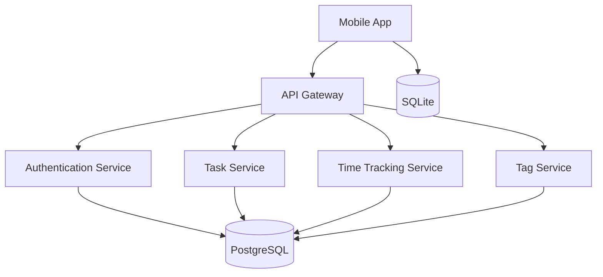
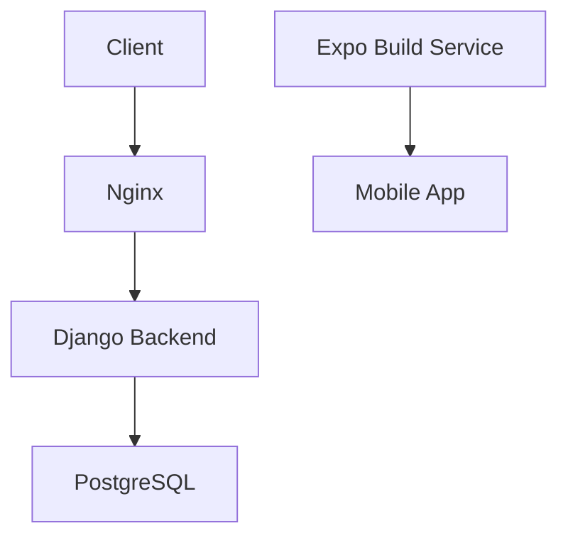
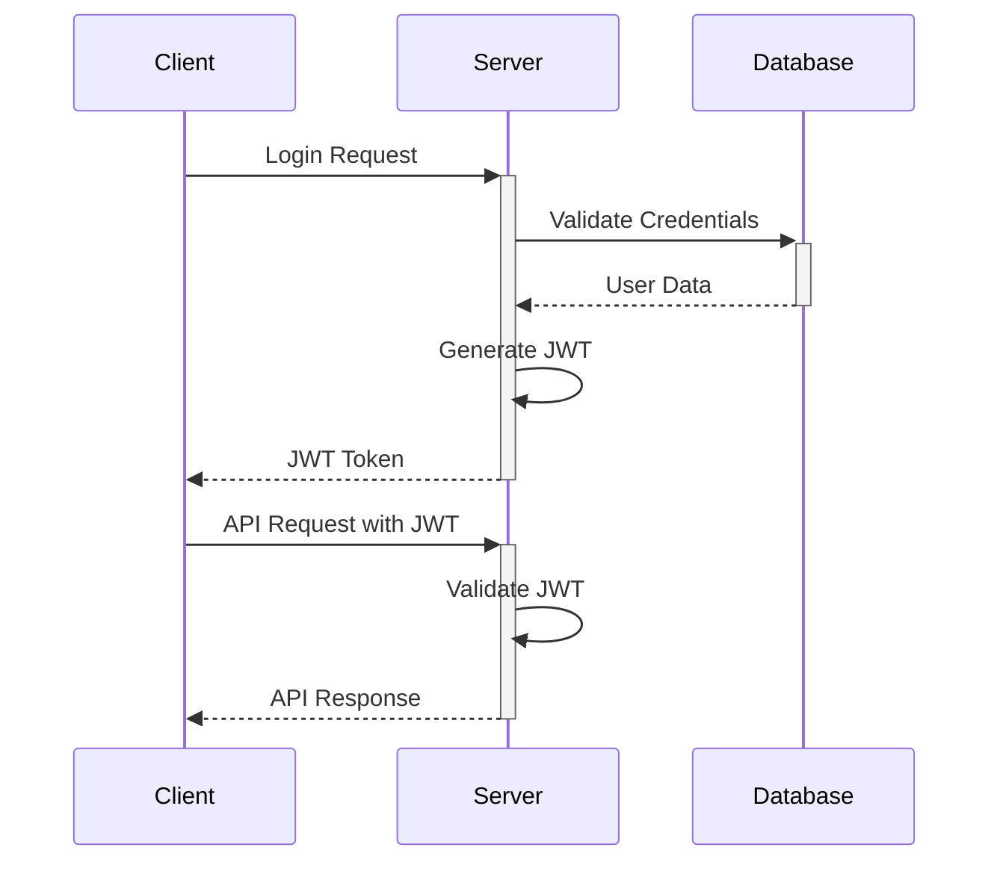
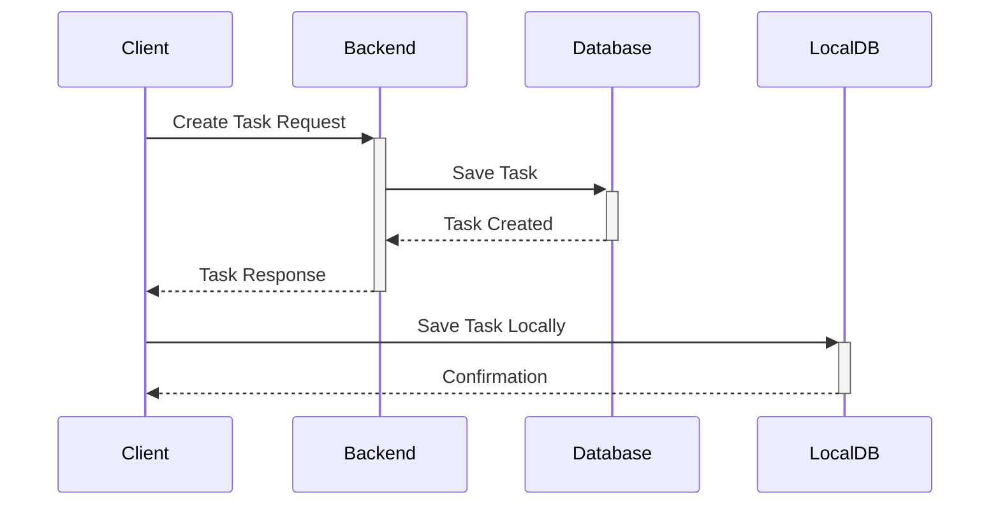
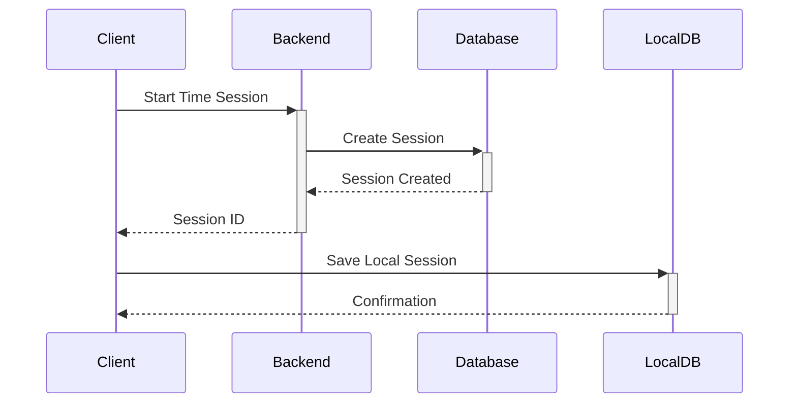

# Technical Architecture Documentation

## System Architecture Overview



## Component Details

### 1. Mobile Application (Frontend)
- **Technology**: React Native with Expo
- **Key Components**:
  - Task Management UI
  - Time Tracking Interface
  - Tag Management
  - Local Storage (SQLite)
  - State Management
  - Navigation System

### 2. Backend Services

#### 2.1 API Gateway
- **Technology**: Django REST Framework
- **Responsibilities**:
  - Request routing
  - Authentication validation
  - Rate limiting
  - Request/Response transformation

#### 2.2 Authentication Service
- **Technology**: Django Authentication
- **Features**:
  - User registration
  - Login/Logout
  - JWT token management
  - Password hashing
  - Session management

#### 2.3 Task Service
- **Technology**: Django REST Framework
- **Features**:
  - CRUD operations for tasks
  - Task status management
  - Task filtering and sorting
  - Task-tag relationships

#### 2.4 Time Tracking Service
- **Technology**: Django REST Framework
- **Features**:
  - Time session recording
  - Duration calculation
  - Session history
  - Time analytics

#### 2.5 Tag Service
- **Technology**: Django REST Framework
- **Features**:
  - Tag CRUD operations
  - Tag-task relationships
  - Tag filtering

### 3. Database Layer

#### 3.1 PostgreSQL (Backend)
- **Tables**:
  ```sql
  -- Users Table
  CREATE TABLE users (
      id SERIAL PRIMARY KEY,
      username VARCHAR(150) UNIQUE NOT NULL,
      email VARCHAR(254) UNIQUE NOT NULL,
      password_hash VARCHAR(128) NOT NULL,
      created_at TIMESTAMP DEFAULT CURRENT_TIMESTAMP
  );

  -- Tasks Table
  CREATE TABLE tasks (
      id SERIAL PRIMARY KEY,
      title VARCHAR(200) NOT NULL,
      description TEXT,
      status VARCHAR(50) NOT NULL,
      user_id INTEGER REFERENCES users(id),
      created_at TIMESTAMP DEFAULT CURRENT_TIMESTAMP,
      updated_at TIMESTAMP DEFAULT CURRENT_TIMESTAMP
  );

  -- Time Sessions Table
  CREATE TABLE time_sessions (
      id SERIAL PRIMARY KEY,
      task_id INTEGER REFERENCES tasks(id),
      start_time TIMESTAMP NOT NULL,
      end_time TIMESTAMP,
      duration INTEGER,
      user_id INTEGER REFERENCES users(id)
  );

  -- Tags Table
  CREATE TABLE tags (
      id SERIAL PRIMARY KEY,
      name VARCHAR(50) NOT NULL,
      color VARCHAR(7) NOT NULL,
      user_id INTEGER REFERENCES users(id)
  );

  -- Task Tags Table
  CREATE TABLE task_tags (
      task_id INTEGER REFERENCES tasks(id),
      tag_id INTEGER REFERENCES tags(id),
      PRIMARY KEY (task_id, tag_id)
  );
  ```

#### 3.2 SQLite (Mobile)
- **Tables**:
  ```sql
  -- Local Tasks Table
  CREATE TABLE local_tasks (
      id INTEGER PRIMARY KEY AUTOINCREMENT,
      title TEXT NOT NULL,
      description TEXT,
      status TEXT NOT NULL,
      sync_status TEXT NOT NULL,
      created_at TIMESTAMP DEFAULT CURRENT_TIMESTAMP,
      updated_at TIMESTAMP DEFAULT CURRENT_TIMESTAMP
  );

  -- Local Time Sessions Table
  CREATE TABLE local_time_sessions (
      id INTEGER PRIMARY KEY AUTOINCREMENT,
      task_id INTEGER,
      start_time TIMESTAMP NOT NULL,
      end_time TIMESTAMP,
      duration INTEGER,
      sync_status TEXT NOT NULL
  );

  -- Local Tags Table
  CREATE TABLE local_tags (
      id INTEGER PRIMARY KEY AUTOINCREMENT,
      name TEXT NOT NULL,
      color TEXT NOT NULL,
      sync_status TEXT NOT NULL
  );
  ```

## Deployment Architecture



### Deployment Components

1. **Web Server (Nginx)**
   - Reverse proxy
   - SSL termination
   - Static file serving
   - Load balancing

2. **Application Server**
   - Django application
   - Gunicorn WSGI server
   - Docker container

3. **Database Server**
   - PostgreSQL
   - Data persistence
   - Backup system

4. **Mobile App Deployment**
   - Expo build service
   - App store distribution
   - OTA updates

## Security Architecture

### 1. Authentication Flow


### 2. Security Measures
- JWT-based authentication
- HTTPS encryption
- Password hashing (bcrypt)
- Rate limiting
- Input validation
- SQL injection prevention
- XSS protection
- CORS configuration

## Data Flow

### 1. Task Creation Flow


### 2. Time Tracking Flow


## Error Handling

### 1. Error Response Format
```json
{
    "error": {
        "code": "ERROR_CODE",
        "message": "Human readable message",
        "details": {
            "field": "Additional error details"
        }
    }
}
```

### 2. Common Error Scenarios
- Authentication failures
- Validation errors
- Database errors
- Network issues
- Sync conflicts

## Monitoring and Logging

### 1. Application Logs
- Request/Response logging
- Error logging
- Performance metrics
- User activity tracking

### 2. System Metrics
- CPU usage
- Memory consumption
- Database performance
- API response times
- Error rates 